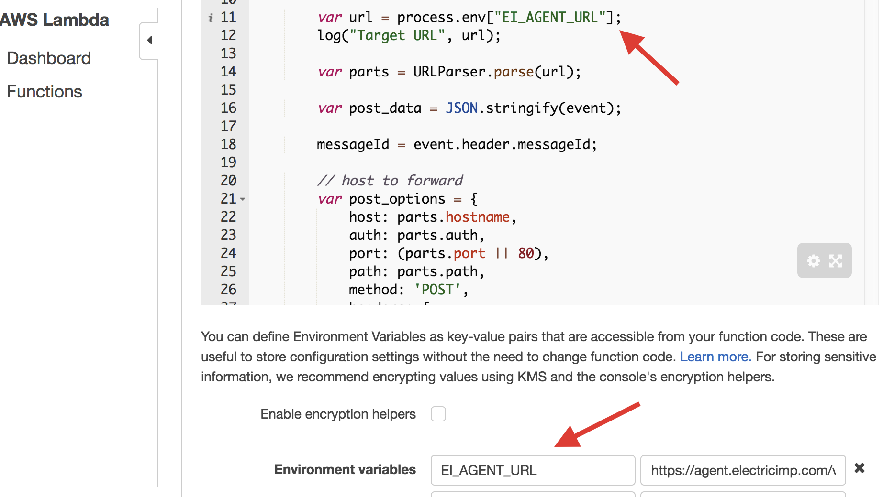

# Demo Installation Notes

## Setup Electric Imp project

1. Create new Model in the [Electric Imp IDE](https://ide.electricimp.com) and copy-paste device/agent code from [device.nut](device.nut) and [agent.nut](agent.nut) correspondingly
2. Next steps require agent URL to configure AWS Lambda. To find it out:
    1. Switch to device list
    2. Select device intended to run the model
    3. Press its setting button
    4. Copy **Agent URL**

## Setup Amazon services

### Prerequisites

Amazon Web Services account is required to run AWS Lambda-based Smart Home Adapter.  The account must be verified, i.e. billing information is entered and accepted.  Account verification may take up to 12 hours.  No service is available prior to this step completion.
To interact with Alexa services the user need devices like Amazon Echo.  "https://echosim.io/" emulator is good for testing as well. Both device or emulator have to be available for Alexa with the account that will be used for development.

### Create new Skill

The steps below will guide you through the creation of a new Smart Home Skill. These steps will guide you through the AWS Lambda and OAuth configuations for this demo example. For more general instuctions on creating a new Smart Home Skill you can visit [Amazon's developer website](https://developer.amazon.com/public/solutions/alexa/alexa-skills-kit/docs/steps-to-create-a-smart-home-skill).

#### Register as an Amazon Developer and Create a Skill

1. Open the Amazon [Developer Portal](https://developer.amazon.com/home.html) in a browser and log in.
2. Navigate to the [Alexa section](https://developer.amazon.com/edw/home.html#/)
by clicking **Apps & Services** and then clicking **Alexa** in the top navigation.
3. In the Alexa Skills Kit box, click **Get Started**.
4. Click the **Add a New Skill** button.
5. On the **Skill Information** page, select **Smart Home Skill API**, and enter the Name for your skill.
Note that your skill’s name must not indicate that it’s functionality is limited.
For example, you should not use “basic”, “reduced” or “simple” in the name of your skill.
6. Select the language for your skill. You can select additional languages later.
7. Click **Save**. and copy the **Application Id** for the skill to the clipboard.

#### Create a Lambda Function

1. In a new browser tab log into your [AWS account](https://aws.amazon.com/console/)
2. Lambda function's are only available in limited regions.  In the top right navigation bar select the **N.Virginia** for English (US) skills or the **EU (Ireland)** region for English (UK) and German skills. Providing your Lambda function in the correct region prevents latency issues.
3. Click the **Services** tab in the upper left navigation, and on the AWS Console under **Compute**, select **Lambda**.
4. Click **Create a Lambda function**.
5. On the **Select blueprint page**, type **home** in the filter box. Select the **alexa-smart-home-skill-adapter**.
6. On the **Configure triggers page**, the **Alexa Smart Home** trigger will already be configured. Add the **Application Id** from the developer portal.
7. Optionally check **Enable trigger**. This enables the Amazon Alexa service to call your Lambda function.
It’s recommended that you enable the trigger later, once you have completed your implementation
and testing in the Lambda portal.
8. Click **Next**.
9. On **Step 3: Configure function**, enter the following:
    * **Name**: A name for your Lambda function. This name is appears in the AWS console and is also returned by the
    AWS command-line interface (CLI) [ListFunctions](http://docs.aws.amazon.com/lambda/latest/dg/API_ListFunctions.html) API.
    It should be unique across your Lambda functions.
    * **Description**: Optionally provide a description.
    * **Runtime**: Select **Node.js 4.3**.
10. For **Lambda function code**, make sure **Edit code inline** is selected.
11. The Lambda script is a request forwarder and requires the URL of a server that implements Smart Home Skill API. The **AlexaSmartHomeSkillAdapter** library turns the Imp's agent into a server, so we will use the Lambda script to forward requests to the **Agent URL**. Copy and paste the following code into the code editor: [AwsLambda/passthrough.js](../AwsLambda/passthrough.js). Then in the **Enviornmental variabls** under the code window, enter `EI_AGENT_URL` as the key and your **Agent URL** (found in the Electric Imp IDE) as the value.

12. The **Handler** should be set to **index.handler**.
13. For **Role**, select a role with lambda_basic_execution policy attached.
To create a new role see,
[Create the Execution Role](http://docs.aws.amazon.com/lambda/latest/dg/with-s3-example-create-iam-role.html)
topic in the Lambda documentation
14. Leave the **Advanced settings** set to the defaults and click **Next**.
15. Click **Create function**.
16. On the summary page, copy the **Amazon Resource Name (ARN)** for your Lambda function, which is found in the upper
right corner, into your clipboard. You will use this value when you configure the smart home skill in the developer
portal. The ARN should be similar to the following:  **ARN - arn:aws:lambda:us-east-1:025463977285:function:myAdapter**
17. If you want to perform a quick test of the Lambda function, you can click on Test and for the
Sample event template, leave the default Hello World. Replace the entire contents of the text editor with the
following code [AwsLambda/test.js](../AwsLambda/test.js). When the test runs its status can be checked at:
    * **AWS CloudWatch** -> `/aws/lambda/<lambda name>`
    * **Agent console** in the Electric Imp Web IDE

#### Finish Registering Your Skill in the Developer Portal

1. Navigate back to your skill in the [Developer Portal](https://developer.amazon.com/home.html). If you closed this tab you will need to log in, and navigate to the Alexa section by clicking **Apps & Services** and then clicking **Alexa** in the top navigation. Select your skill from the displayed list. This should bring you back to the **Skill Information** page, where we left off in the **Register as an Amazon Developer and Create a Skill** section.
2. On the **Skill Information** page click **Next**.
3. On the **Interaction Model** page click **Next**. The interaction model, which is what a user can say to invoke the Smart
Home Skill API, is predefined so does not need to be specified. For details of the smart home voice interaction model,
see the utterances listed with each reference entry in the
[Smart Home Skill API Reference](https://developer.amazon.com/public/solutions/alexa/alexa-skills-kit/docs/smart-home-skill-api-reference).
4. On the **Configuration** page, under the **Endpoint** heading click the checkbox to select the geographical region closest to your target costomers, then copy in the ARN number from the Lambda function you created.
5. To set up **Account Linking** authortizaion we need to create a security profile.
  * Copy the **Redirect URLs** URLs from the Skill configuration page (optional-aws bug?)
  * In a new tab open up [**APPS & SERVICES** and then click **Security Profiles**](https://developer.amazon.com/iba-sp/overview.html)
  * Fill out the Security Profile Name and Description then click **Save**
  * In the **Web Settings** tab and add "Return URLs" with URLs from step 5-1 (optional-aws bug?)
  * Use `https://amazon.com` for **Allowed Origins** (optional-aws bug?)
  * Switch back to the **General** tab and copy **Client Id** and **Client Secret**
  * Navigate back to the *Smart Home Skill Configuration* page, **Account Linking** section and fill in:
    * **Authorization URL** with `https://www.amazon.com/ap/oa`
    * **Client Id** with the **Client Id** from the Security Pofile
    * **Access Token URI** with `https://api.amazon.com/auth/o2/token`
    * **Client Secret** with **Client Secret** from the Security Pofile
6. Press "Next" button and ensure "Configuration" tab is marked as green
7. Check "Yes" against " Show this skill in the Alexa App" at "Test" tab

## Use new Skill with your Alexa Account

Now the newly created **Alexa Skill** should be available at Alexa web configurator:

1. Login at [alexa.amazon.com](https://alexa.amazon.com) with the developer account
2. Goto **Skills** section and click on **Your Skills** button at upper-right corner of the page
3. Select the Skill and push the **Enable** button
4. Electric Imp powered device that implements the Skill is now discoverable at **Smart Home** tab
5. Verify it's functionality with the voice command: `"Alexa, discover my devices"`
6. If everything is OK, ask Alexa to turn your device on or off: `"Alexa, turn on the smart toaster"`

## License

AlexaSmartHomeSkill library is licensed under the [MIT License](../LICENSE).

